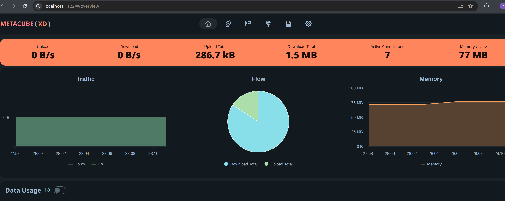

_Clash_ is an essential tool for *free* Internet access in China. Over the past few years, I’ve used several different Clash GUIs (e.g., _clash-verge_, _clash-verge-rev_, and _clash-windows_). One frustrating issue is that many bugs originate from the GUI frameworks—such as Tauri—rather than from the Clash core itself.

## The Docker solution

Today, I migrated those stuffs into Docker. In `dokcer-compose.yml`:

```yml
services:
  clash: # Clash Core
    container_name: clash-meta
    image: metacubex/mihomo:v1.19.17
    restart: always
    pid: host
    ipc: host
    network_mode: host
    cap_add:
      - ALL
    security_opt:
      - apparmor=unconfined
    volumes:
      - ~/.config/clash_meta/clash:/root/.config/mihomo
      - /dev/net/tun:/dev/net/tun
      - /etc/timezone:/etc/timezone:ro
      - /etc/localtime:/etc/localtime:ro

  metacubexd: # Clash WebUI
    container_name: metacubexd
    image: ghcr.io/metacubex/metacubexd
    restart: always
    network_mode: bridge
    ports:
      - "1122:80"
    volumes:
      - ~/.config/clash_meta/caddy:/config/caddy
      - /etc/timezone:/etc/timezone:ro
      - /etc/localtime:/etc/localtime:ro
```

Next, put your configuration files into `~/.config/clash_meta/clash`, and the entry file should be `config.yaml`, in which you need to set up the `external-controller` as well as its `secret`.

```yml
mixed-port: 7890
external-controller: 0.0.0.0:9090
secret: <YOUR_KEY>
```

Then, start the docker containers via `docker-compose up -d`. 

## The Web-UI

Visit `localhost:1122`, where the port is mapped in `dokcer-compose.yml`. Enter both the URL (i.e., `http://127.0.0.1:9090`) and the key in `config.yaml`.



To maximize the flexibility, [proxy-providers]()(https://wiki.metacubex.one/config/proxy-providers/) and [proxy-group](https://wiki.metacubex.one/config/proxy-groups/) are recommended in `config.yaml`.