>In [Fluent Python, 2nd Edition](https://www.oreilly.com/library/view/fluent-python-2nd/9781492056348/)shows a `+=` assignment puzzle in Python 3.10, and the author use the bytecode for expression `s[a] += b` to explain what happens under the hood. However, in new version for Python, and in my case, it is Python 3.12, the generated bytecode is different.

## Bytecode for the expression `s[a] += b`

```python
>>> dis.dis('s[a] += b')
  0           0 RESUME                   0

  1           2 LOAD_NAME                0 (s)
              4 LOAD_NAME                1 (a)
              6 COPY                     2
              8 COPY                     2
             10 BINARY_SUBSCR
             14 LOAD_NAME                2 (b)
             16 BINARY_OP               13 (+=)
             20 SWAP                     3
             22 SWAP                     2
             24 STORE_SUBSCR
             28 RETURN_CONST             0 (None)
```


## Explanation

>[!tip]
>Readers can refer to [ `dis` — Disassembler for Python bytecode](https://docs.python.org/3/library/dis.html#module-dis "Link to this heading")
>

The left-most column is the line number, in which `RESUME`, introduced in Python 3.11, is a special no-op, and it performs internal tracing, debugging and optimization checks. What we are interested is Line 1.

The second column is the offset of an instruction. Since Python 3.6,  it uses 2 bytes for each instruction.

The third column is the instruction:

- `LOAD_NAME`: push the value associated with the name into the stack. The forth column is the id of the name.

So, after executing `LOAD_NAME` twice, the stack is `[s, a]` (the stack top is the last).

- `COPY`:  copy and push the i-th item to the top of stack. (Note that the index is 1 based) This instruction is introduced in Python 3.11.

After executing `COPY` twice, the stack is:

```mermaid
gantt
    title Stack Top
    dateFormat X
    tickInterval 1day

    section  
    a   : 0, 1
    s   : 0, 1
    a  : 0, 1
	s   : 0, 1
```



- `BINARY_SUBSCR`：get the key, and the container, respectively, and then push the value. To put it in another way, it implements:

```python
key = STACK.pop()
container = STACK.pop()
STACK.push(container[key])
```

After loading `b`, the stack becomes:


- `BINARY_OP`: implements the binary and in-place operators.

```python
r = STACK.pop()
l = STACK.pop()
STACK.push(l op r)
```

So, the stack becomes:


- `SWAP`: swap the top of the stack with the i-th element. This instruction is introduced in Python 3.11.

After `SWAP 3`, the stack becomes:


After `SWAP 2`, the stack becomes:


The objective of swapping twice is for the ease of getting `s[a]`.

- `STORE_SUBSCR`: to update the container value.

```python
key = STACK.pop()
container = STACK.pop()
value = STACK.pop()
container[key] = value
```

After this instruction, the stack is empty, and `s[a]` becomes `s[a] + b`.

Since this assignment doesn't return anything, it returns a constant `None`, which is called by `RETURN_CONST`, introduced in Python 3.12.