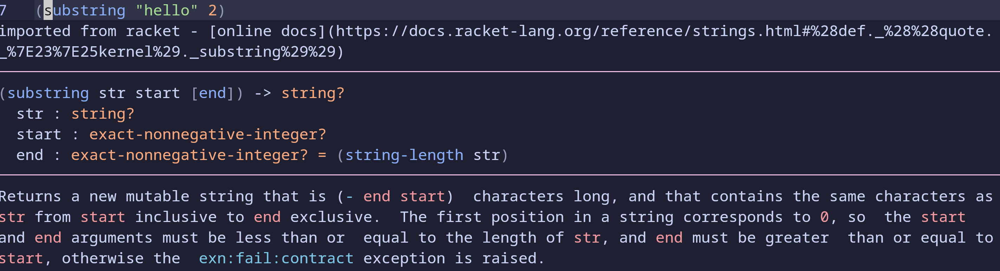
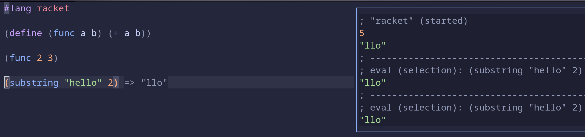

Although `DrRacket` is great, I prefer a more lightweight way to enjoy Racket using `Neovim`.

## Step 1: Install [racket-langserver]

```bash
raco pkg install racket-langserver
```

## Step 2: Config with `nvim-lspconfig`

I am using [LazyVim](https://www.lazyvim.org/):

```lua
  {
    "neovim/nvim-lspconfig",
    opts = {
      servers = {
        racket_langserver = {},
      },
    },
  },
```

After that, we can enjoy nice functionalities powered by Racket LSP, e.g., *doc lookup*, *auto-complete*, and *go-to-definition*.



> I found that even if [tree-sitter-racket](https://github.com/6cdh/tree-sitter-racket) is not installed, the highlight still works well. Why?

## Step 3: Configure [conjure](https://github.com/Olical/conjure)

To enhance the REPL, I further set up the `Conjure` in `LazyVim`.

```lua
  {
    "Olical/conjure",
    ft = { "racket", "scheme" },
    lazy = true,
    init = function()
    end,
  },

```

To evaluate the selected code, press `<localleader>E`. As for LazyVim, the default `localleader` is `\`.

