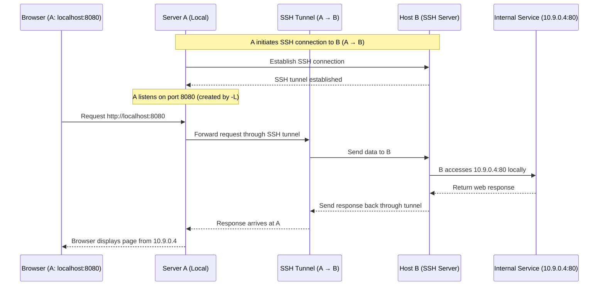
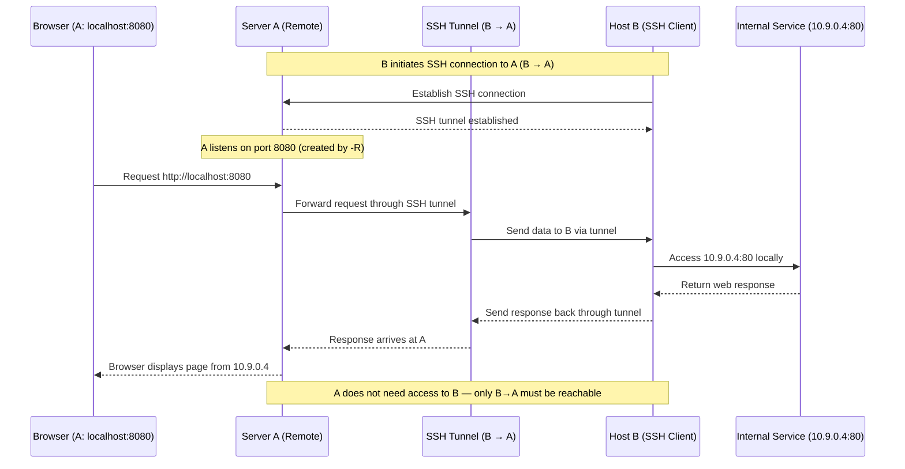

`SSH` provides many powerful tricks. In this article, I illustrated two useful commands which I frequently used recently.

## 1. How to authenticate in my server?

One month ago, the Internet access in my lab requires an authentication via the username and password in the browser. However, the server is not shipped with any desktop environment.

### Precondition

- Our client `A` is able to connect to server `B`
- The authentication IP is `10.9.0.4` (*well it is exactly the IP used in my lab*)

I want to finish the Internet authentication for `B` on `A`.
### Solution

We execute the following command on `A`:

```bash
ssh -L 8080:10.9.0.4:80 user@B
```

> The IP address here can also be replaced by its domain name.

Then, we can use `localhost:8080` in `A` to access the authentication web page.

If we would like to forward the port only (*do not execute a remote command*), then we can use `-N` option:

```
ssh -N -L 8080:10.9.0.4:80 user@B
```

### Explanation

```bash
-L [bind_address:]port:host:hostport
-L [bind_address:]port:remote_socket
-L local_socket:host:hostport
-L local_socket:remote_socket
```

> Specifies that connections to the given TCP port or Unix socket on the local (client) host are to be forwarded to  the  given  hostand  port, or Unix socket, on the remote side.  
> 
> This works by allocating a socket to listen to either a TCP port on the local side,optionally bound to the specified bind_address, or to a Unix socket.  Whenever a connection is made to the local  port  or  socket,the  connection  is  forwarded  over  the secure channel, and a connection is made to either host port hostport, or the Unix socketremote_socket, from the remote machine.Port forwardings can also be specified in the configuration file.  Only the superuser can forward privileged ports.  IPv6 addresses can be specified by enclosing the address in square brackets.By default, the local port is bound in accordance with the GatewayPorts setting.  
> 
> However, an explicit bind_address may be used  tobind  the  connection  to a specific address.  The bind_address of “localhost” indicates that the listening port be bound for localuse only, while an empty address or ‘*’ indicates that the port should be available from all interfaces.

Therefore, this command will **forward** the *local* `80` port to the remote (i.e., `B`)'s `10.9.0.4:80`.




### Solution 2

If `B` is able to connect to `A`, then we can also leverage *SSH reverse tunneling* by `-R` option.

```bash
-R [bind_address:]port:host:hostport
-R [bind_address:]port:local_socket
-R remote_socket:host:hostport
-R remote_socket:local_socket
R [bind_address:]port
```


> Specifies that connections to the given TCP port or Unix socket on the remote (server) host are to be forwarded to the local side.

Therefore, we can execute the following command on `B`:

```bash
ssh -N -R 8080:10.9.0.4:80 user@A
```

In this way, we can also visit the authentication web page via `localhost:8080` on `A`.





## 2. How to access Internet through proxies?

In China, many websites are blocked, so we have to resort to proxies. In general, our desktop computer (i.e., client `A`) has installed the proxy service via `Clash`. But it would be tedious to set up such proxy services for every remote server.

### Preconditions

- `A` provides the proxy services in *TNU* mode.
- `B` can connect to `A`.

I want to use the proxy service on `B`.

### Solution

On `B`, we execute the command:

```bash
ssh -N -D 1080 user@A
```

```bash
-D [bind_address:]port
```


> Specifies a local “dynamic” application-level port forwarding.  This works by allocating a socket to listen to port on the local side,  optionally  bound to the specified bind_address.  
> 
> Whenever a connection is made to this port, the connection is forwarded over the secure channel, and the application protocol is then used to determine where to connect to  from  the  remote  machine.Currently  the  SOCKS4 and SOCKS5 protocols are supported, and ssh will act as a SOCKS server.  Only root can forward privileged ports.  Dynamic port forwardings can also be specified in the configuration file. IPv6 addresses can be specified by enclosing the address in square brackets.  Only the superuser can forward  privileged  ports. 
> 
> By  default, the local port is bound in accordance with the Gateway Ports setting.  However, an explicit bind_address may be used to bind the connection to a specific address.  The bind_address of “localhost” indicates that the listening port  be  bound  for local use only, while an empty address or ‘*’ indicates that the port should be available from all interfaces.


Next, we set up the proxy address on `B`:

```bash
export ALL_PROXY="socks5h://127.0.0.1:1080"
export HTTP_PROXY="socks5h://127.0.0.1:1080"
export HTTPS_PROXY="socks5h://127.0.0.1:1080"
```

The *dynamic* forwarding also works well if server `A` is located outside China. In other words, `A` is able to access the Internet freely.

## 3. How to view the localhost pages?

The method, in fact, is identical with the one in *1. How to authenticate in my server?*. For example, suppose `B` hosts a localhost web page, such as Jupyter notebook, and I want to view it on `A`.

Assume the port on `B` is 8080, then:

```bash
ssh -N -L 8080:127.0.0.1:8000 user@B
```